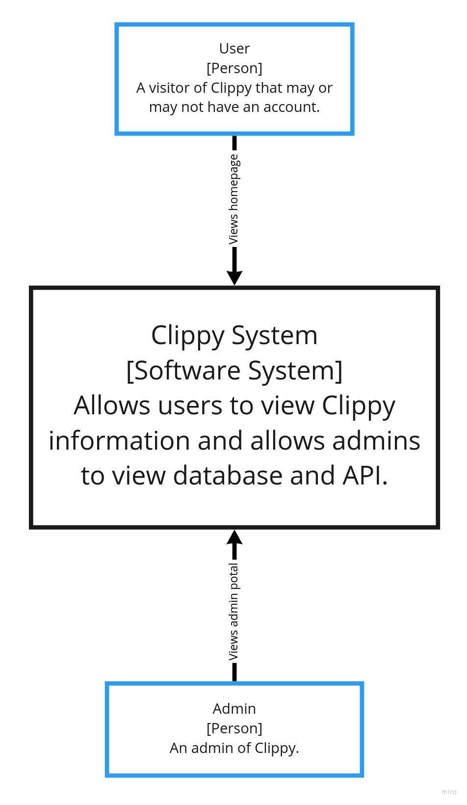
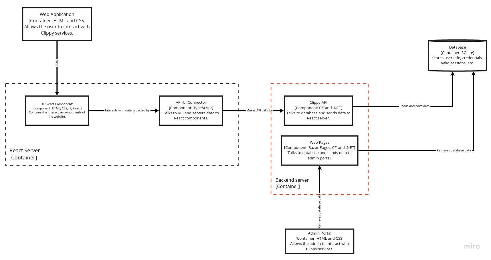
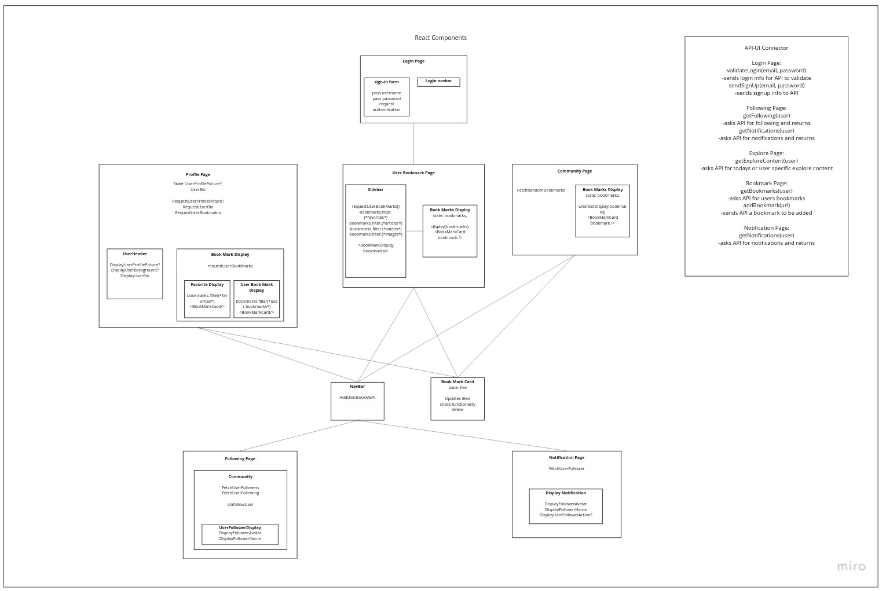
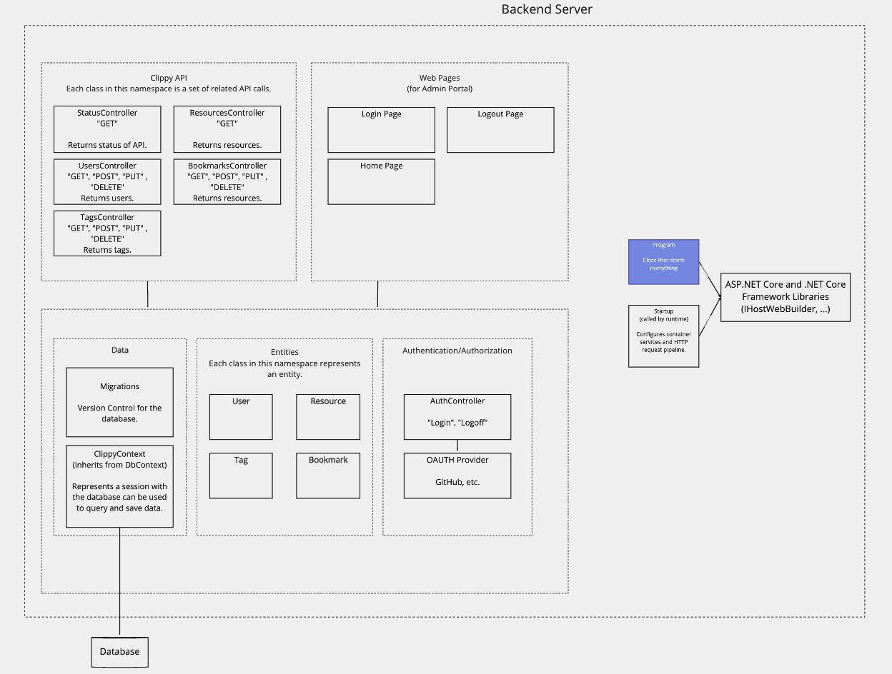
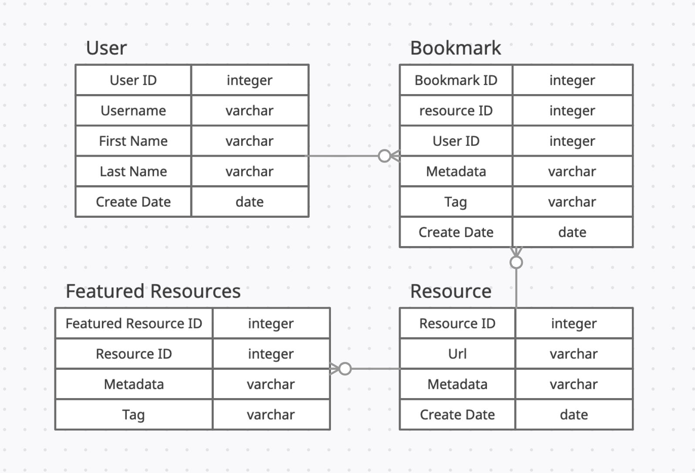
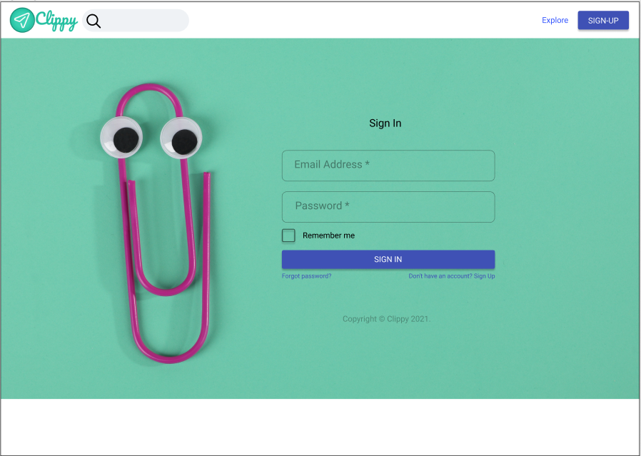
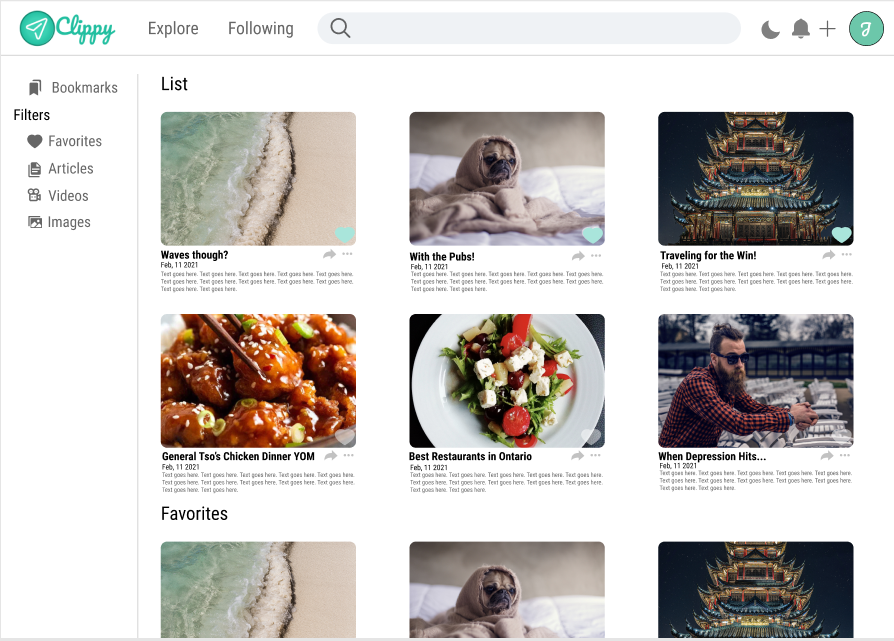
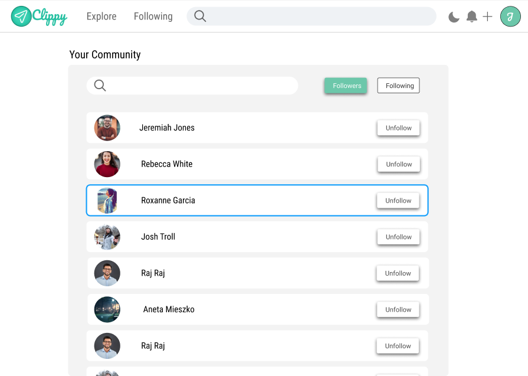
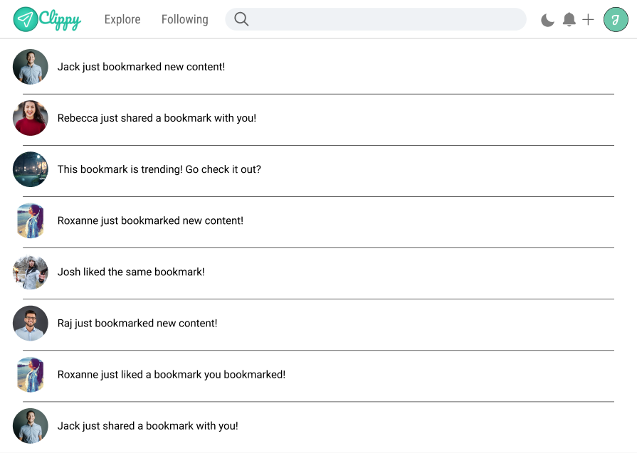

# Program Organization

System Context Diagram

Our system involves one monolithic system appearing to the main user. Everything they interact with will go through this, since at this point both the web-based user interface and API are used exclusively with each other.

Container Diagram

The user will interact with a web-based application that is created and compiled with React.js. The web server used to deliver the compiled HTML, CSS, and Javascript files will be dubbed the "React Server." As part of the scripts involved on the React Server, it will make API calls to an exposed API server, dubbed the "Backend Server." The Backend Server will communicate with the connected database to send and receive information for the user interface. The Backend Server/database and the React Server, for now, will operate on the same machine out of conciseness, but could easily be on different machines if desired.

In addition to the React Server and the Backend Server, there will be a separate administrator portal that can directly communicate with the Backend Server, circumventing the use of API calls. This is essentially a backdoor for development purposes to allow access to the database outside of the main interface.

Component Diagram

Within the React Server, the Javascript files are broken into two categories: user interface and API-UI connection. In the former category, these files are completely dedicated to the visual presentation of information. In the ladder category, the API-UI Connector verifies user input, makes API calls, and retrieves information to be returned to the user interface.

Within the Backend Server, the Clippy API acts as an intermediate party between the user interface and the database. Alongside this, an additional web server will be available to allow for direct access to the database. This is intended for development purposes. While not explicitly shown in the diagram, the Backend Server will contain the database locally alongside the API and administrator web server.

 

All components related to user functionality (React Server and Clippy API) were created to fulfill user stories 001, 002, 003. The administrator portal is a result of user story 018.

# Code Design

## Front End Description

The front end will be composed of 5 pages, each connected by a router.

The login page is used to send the user's inputs gathered by the sign-in form component to be authenticated and is the gateway to the other pages.

The bookmark page component is composed of a sidebar component, that fetches the user's bookmarks to be filtered and sent to the bookmark display component which displays the props by calling multiple bookmark card components.

The profile page component is composed of two components. The user header, which displays the user's information, as well as the bookmark display components, which will display the filtered bookmarks by calling the bookmark card component.

The community page component consists of a bookmarks display component that also calls a bookmark card component to display the bookmark data.

The following page component calls the community component that fetches the user followers and following data and passes it to a user follower display component to then display such data.

Finally, the notification component fetches the user's follower's data and sends the said data to the display notification components that will then display the desired information.

All components have a navbar component that links all of them together.

 

    

## Backend Server (from level 4 C4 Model)

## Backend Server Description
The Clippy API is a set of controllers that make up the REST API. Each controller handles a subset of related API requests from the frontend web application. These controllers mainly send and retrieve data from the database.

Various web pages are used by the Admin Portal to administer the database, REST API, configuration settings, and processes.

There is a set of core features used by the Clippy API and the Admin Portal for authentication and authorization, database access and version control.

The API and Admin Portal use Microsoft .NET 5, which requires few classes, such as Program and Startup, to bootstrap and run these services.

### User Story Association

| Class               | User Story IDs                           |
|---------------------|-----------------------------------------|
| StatusController    |                                         |
| UsersController     | 001 016                                 |
| TagsController      | 013                                     |
| ResourcesController | 003 010 017                             |
| BookmarksController | 003 004 006                             |
| AuthController      | 001 016                                 |
| User                | 001 002                                 |
| Resource            | 003 006                                 |
| Bookmark            | 003 004 006                             |
| Tag                 | 013                                     |
| ClippyContext       | 001 002 003 004 006 010 013 016 017 018 |

# Data Design

# Business Rules

**Note:** This list is not all-inclusive.

- The database must never be out of date with the user interface. For example, if a change is made on the user interface, the user interface must not update and reflect those changes until the database has confirmed and finished the transaction.
- The user interface must never have direct access to the database. Instead, there must always be an intermediate party that is connected to in order to communicate with the database.
- It is assumed that there will be malicious data being sent in every step of Clippy's functionality. There must always be checks to validate the data passed into every function created.
- Performance is not considered a strict priority for this project, however, all interactions must have immediate feedback. Even if a transaction is being processed, there must still be feedback showing that some action is happening.
- Security is important to the operation of Clippy. At the very least, all information must be transferred over a secure protocol and sensitive data (like passwords and session keys) must be either hashed using a cryptographic hashing algorithm or encrypted with a sufficiently secure protocol.

# User Interface Design

To access Clippy, the user must first create an account or log in. Once the login is successful, the user will be with the explore page which displays trending bookmarks. The user then has the freedom to access their following page, profile page, notifications page, and bookmark page through the navigation bar.

    

The user bookmark page can be accessed by clicking "favorite bookmarks" or "posts" on the profile page. The bookmark page is where the user will be given the capability of managing their bookmarks. They will be able to sort, delete, unfavorite, and share their bookmarks.

    

The explore page will show the user a simple display of the trending bookmarks. The user will be able to add these bookmarks to their own favorites list.

    

The following page will display either the list of followers or the list of following. This list will be sorted by the search input, if used. The user can then unfollow any user they desire.

    

The profile page will display the user's information. Here, the user will be shown a list of recent bookmarks, followers, and favorite bookmarks. The user will also be able to change their biography.

    

The notifications page will simply show the user follower's actions.

    

| UID |   Component    | Description                                                       |
| --- | :------------: | ----------------------------------------------------------------- |
| 001 |  Log in page   | The only entrance to the web app is by login                      |
| 004 | Bookmark page  | The bookmark page grats those capabilities.                       |
| 005 | Bookmark page  | The bookmark page gives the sorting capability.                   |
| 008 | Navigation bar | The bookmark page gives the sorting capability.                   |
| 009 |  Log in page   | The login page displays the logo.                                 |
| 010 | Community page | The community page grants the ability to see community bookmarks. |
| 013 | Community page | The community page lets users favorite bookmarks.                 |
| 015 | Bookmark page  | The user bookmark page lets the user sort their bookmarks         |
| 017 | Community page | The community page grants the ability to see community bookmarks. |

The User Interface Design with connecting transitions and user story documentation is also [here](https://www.figma.com/file/IhVm7SrVe4bDZPFF8QcuLI/Clippy-UI-Mockup?node-id=0%3A1). There you can preview the UI by clicking through each dynamic component.

# Resource Management

Given the architecture as it is currently and the number of users expected to use Clippy, we foresee that the architecture should be able to handle load reasonably. For this reason, the currently pre-built solutions for handling API calls with the .NET libraries should be appropriate. In the case that system load exceeds what can be reasonably handled, the architecture would be reevaluated.

# Security

Certainly with most web-based applications, security poses a major role in architecture considerations. In the case of Clippy, we will have a two-fold security measure in terms of API calls with the database. First, there will be a component between the API and the user interface, aptly called the API-UI Connector. This component will sanitize the data that comes from user input. Once the API call is received, the API will then check again for the validity of its input, since the API could be called directly from a third-party application. In the event that the input is invalid or possibly malicious, the input will be rejected. Any information transferred over the internet will use the HTTPS protocol. There are no plans at this time to implement rate limiting or IP-based banning.

In terms of storage, any sensitive information like passwords or login keys will be hashed using SHA-2.

# Performance

The current system in place to deploy Clippy should be noted to be a low-power system, so there is reason to believe it may not perform well in extreme cases. For the state that the project is in now, it is expected that system performance should still meet the expectations for the quantity of users that will be on Clippy concurrently. For the purposes of illustration, it is expected that 30 users should be able to be handled simultaneously. There is not sufficient data to determine whether these expectations are able to be met at this time.

# Scalability

The system is currently designed in a way where basic functionality should be available for up to 30 users concurrently. Since, again, there is no data to determine how this system will perform under heavy load at this time, a lower number of concurrent users will be used to estimate performance. The system is not expected to grow considerably, so scalability will not be considered a priority at this time.

# Interoperability

The server will be alone in its operation and have no need to share resources with other systems. There may be third-party cloud services used to provide OAuth login support, but these resources will be considered independent to the server containing the web server, API, and database.

# Internationalization/Localization

There is no intention at this time to support l18n or i10n for Clippy. It will only be available in English using the en_US locale. Unicode will be the default character set.

# Input/Output

All data will be handled just-in-time. The only data being written to and from local storage is the database, and tremendous corruption of data is not expected. Manual backups of the database will be kept at regular intervals to assure data is not lost in the worst situation.

# Error Processing

On a broad level, errors will only be detected, not corrected. Each class that receives input will check the validity of its incoming data before proceeding further. If for any reason, an input is perceived to be invalid, it will be rejected and the user would be shown an error message. The system will not attempt to proceed further. The system will anticipate errors with sanitization and validity checking.

Error messages will use a predefined set of strings available for the user, using as little variable output as possible. This will prevent malicious data collection from error messages to occur. In the event that an error needs further explanation, temporary debugging code will be written, to be removed upon resolving the issue.

All exceptions will be caught, providing information in the Javascript debugging console, given that proper debugging flags are enabled. The end-user should have little access to this information as to avoid possible leakage of sensitive data. Errors will be passed up the call chain.

# Fault Tolerance

The system presently is not intended to tolerate faults. Either an operation succeeds or fails, passing the result to the end user. This way, there is no ambiguous operations that arise from attempting to fix the error using an alternate method.

# Architectural Feasibility

Within the resources available, the architecture of the system should be feasible in its operation. The system is small enough to the extent that this is not a concern for the time being.

# Overengineering

To allow for expandability to other operating systems and architectures outside of web alone, Clippy uses an API as an intermediate party between the database and the user interface. Generally, this project's approach will err on the side of overengineering to achieve this goal.

# Build-vs-Buy Decisions

With the novice level of experience between the developers involved in this project, the option was chosen to use pre-made solutions for many of the components in this project. As time progresses, first-party solutions may be used to replace the existing solution.

- User interface components will use the [React framework](https://reactjs.org/), specifically using components from [Material-UI](https://material-ui.com/).
- The API will be handled using [Swagger](https://github.com/domaindrivendev/Swashbuckle.AspNetCore), built with ASP.NET Core.
- To interact with the database, the [SQLite Entity Framework Core Database Provider](https://docs.microsoft.com/en-us/ef/core/providers/sqlite/) from the .NET framework will be used.
- The administrator portal will use [Razor Pages](https://docs.microsoft.com/en-us/aspnet/core/razor-pages/) in ASP.NET Core.

# Reuse

Other than the decisions made in the previous section, any other components or applications will be created by hand.

# Change Strategy

The architecture is designed to be modular in that if one component is no longer fit for the intentions of the project, it can be replaced without affecting the other components. While there may be slight changes that need to be made to other components, this would be an exceptional case.
