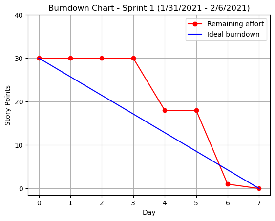
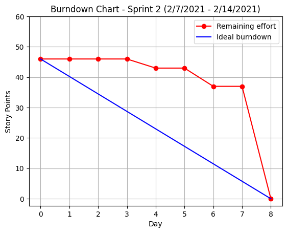
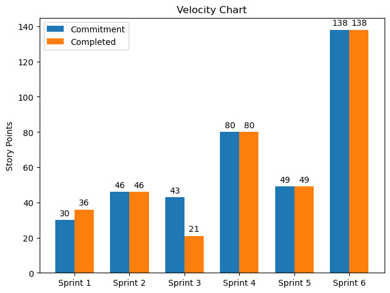

# Burndown and Velocity Charts

To generate charts, simply run `main.py`:

```
$ python3 main.py
```

<details><summary>Burndown Chart - Sprint 1</summary>

</details>

<details><summary>Burndown Chart - Sprint 2</summary>

</details>

<details><summary>Velocity Chart</summary>

</details>
